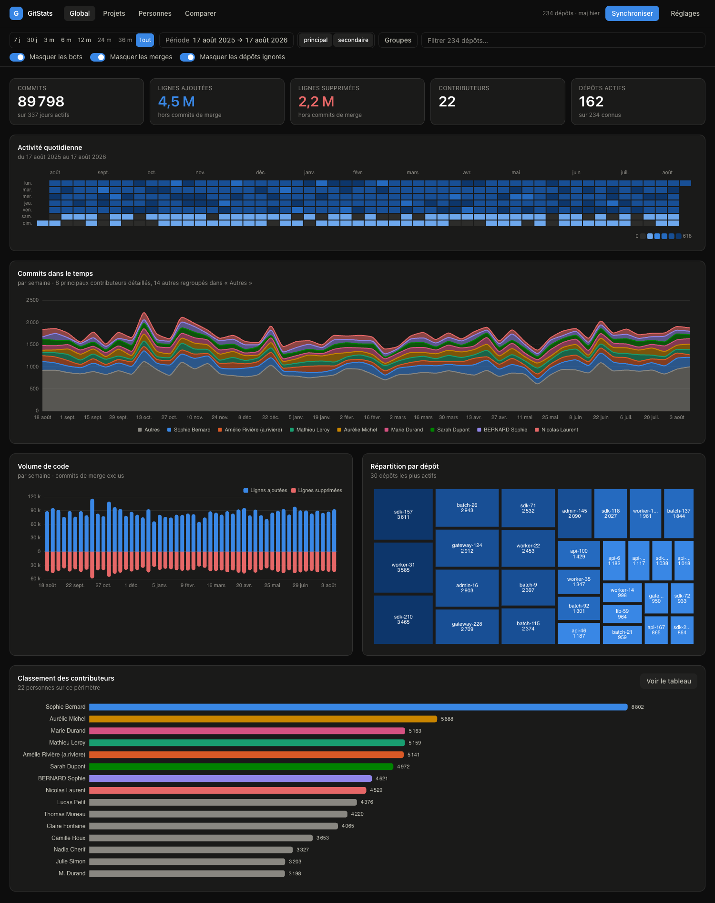
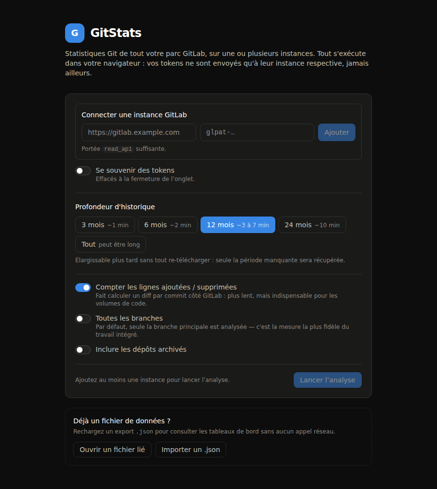
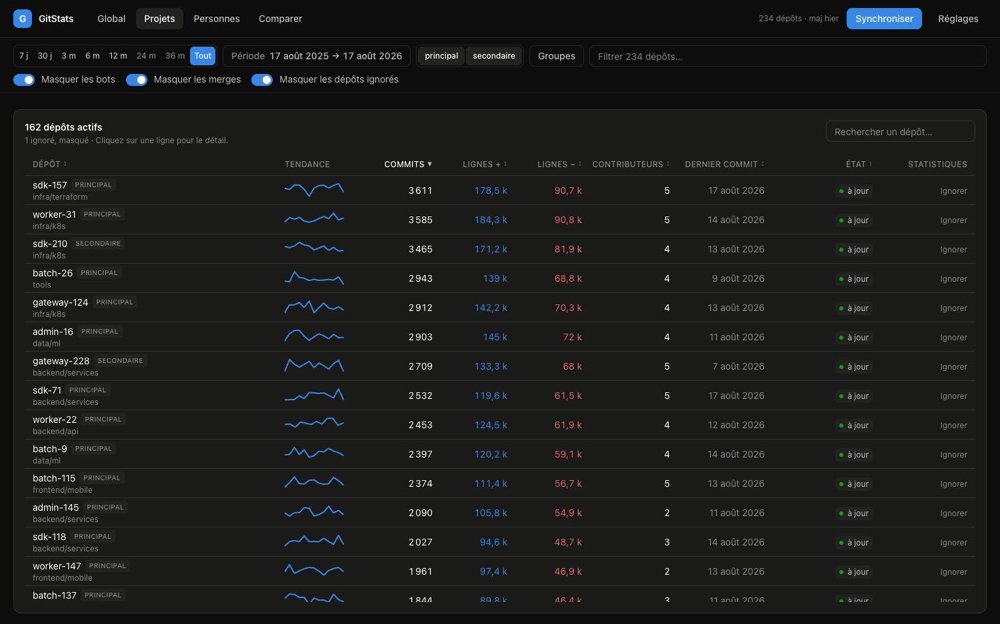
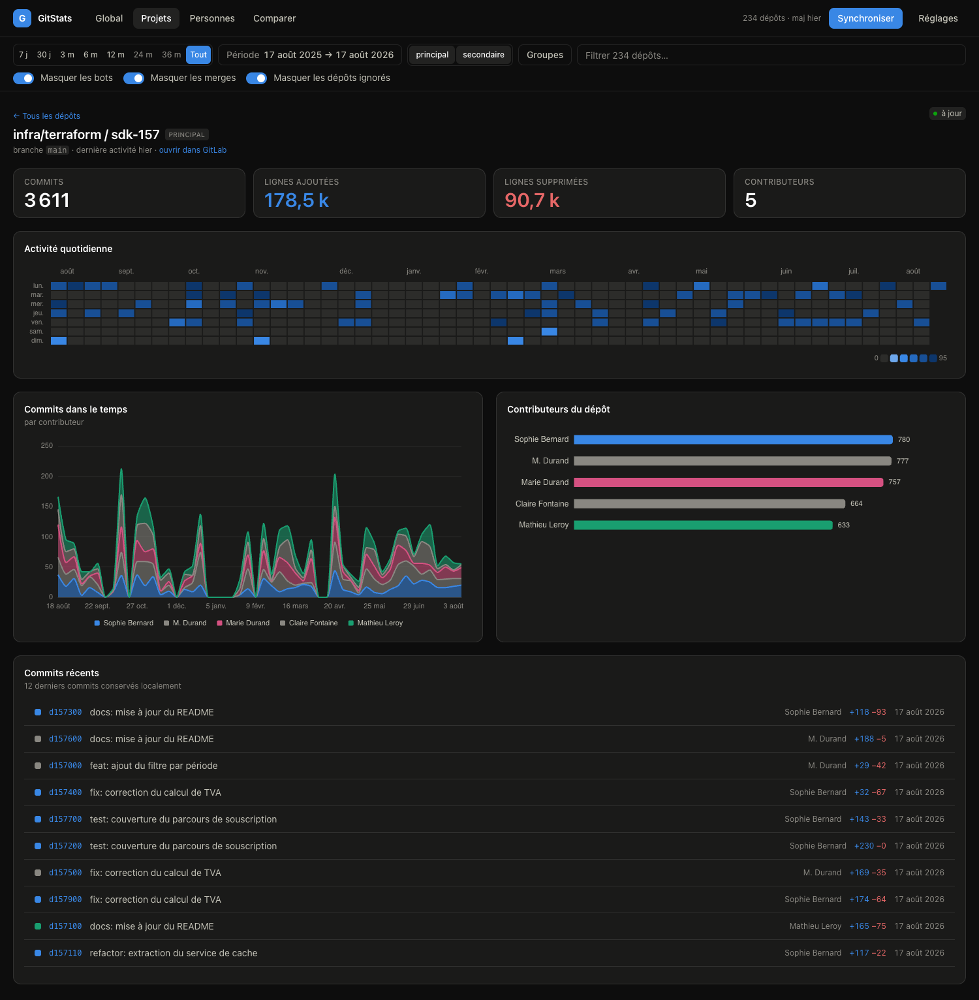
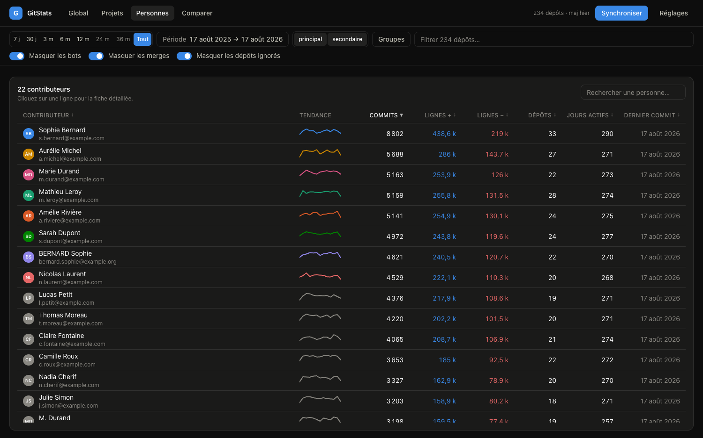
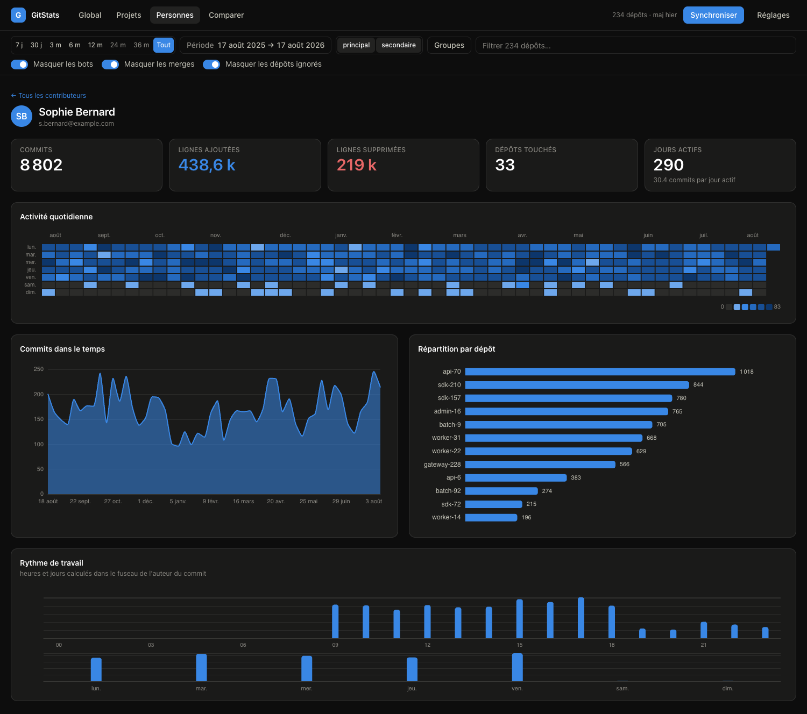
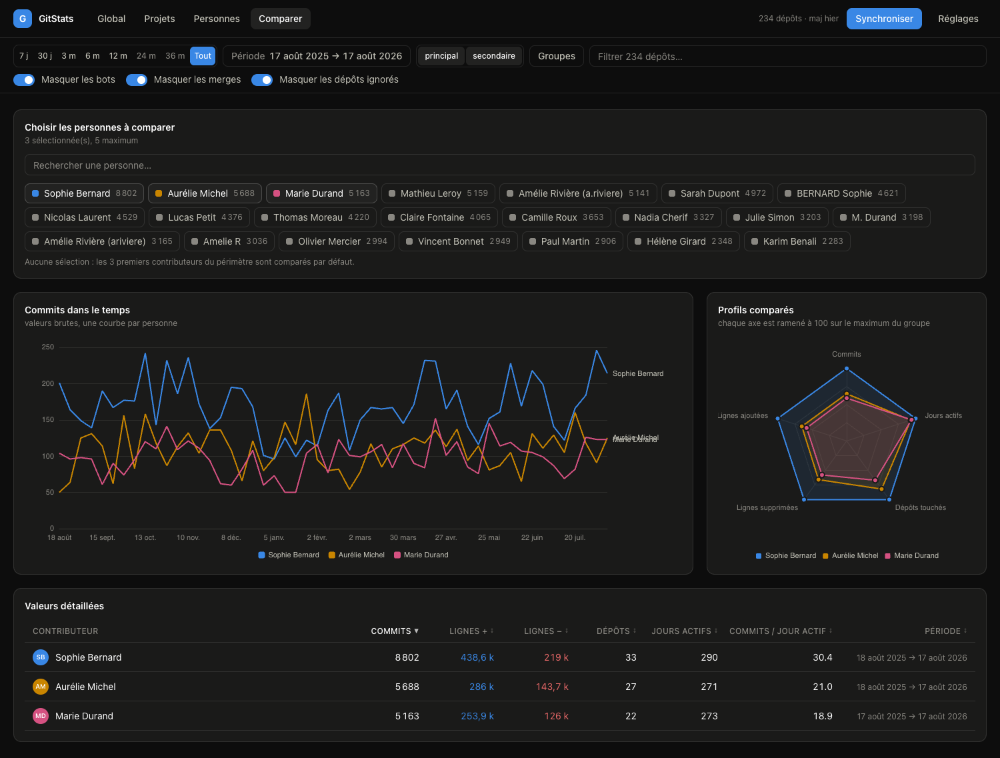
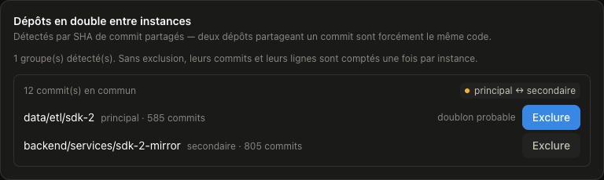

<h1 align="center">GitStats</h1>

<p align="center">
  <strong>Tableau de bord d'activité Git pour tout un parc GitLab — sur une ou plusieurs instances.</strong><br>
  100 % dans le navigateur : aucun backend, aucun proxy, aucune donnée qui sort de votre machine.
</p>

<p align="center">
  
  
  
  
  <a href="LICENSE"></a>
</p>

<p align="center">
  <a href="https://etiennepasteur.github.io/GitStats/"><strong>Ouvrir l'application →</strong></a>
</p>



---

## Le problème

GitLab sait montrer l'activité d'**un** dépôt. Il ne sait pas répondre à « qu'est-ce
qui s'est passé sur nos 234 dépôts cette année ? », encore moins quand ils sont
répartis sur **deux serveurs différents**. Les outils qui le font demandent en
général un backend, une base, un compte de service — donc une décision
d'hébergement, une revue de sécurité, et un token qui vit ailleurs que chez vous.

GitStats prend l'autre chemin : c'est une page statique. Votre navigateur appelle
lui-même l'API de chaque instance GitLab avec votre Personal Access Token, agrège
les résultats, et les stocke en local. Rien à déployer, rien à administrer, et le
token ne quitte jamais l'onglet.

- **Aucun serveur** — `npm run build` produit un dossier de fichiers statiques.
- **Multi-instances** — plusieurs GitLab agrégés dans les mêmes vues, y compris
  les personnes présentes sur les deux.
- **Incrémental** — le premier passage coûte quelques milliers d'appels, les
  suivants moins de cent.
- **Vos données restent vôtres** — IndexedDB, plus un fichier `.json` que vous
  contrôlez. Les tokens ne sont jamais écrits dedans.

---

## Essayer en deux minutes, sans token

L'application est publiée telle quelle sur GitHub Pages :
**<https://etiennepasteur.github.io/GitStats/>**. C'est le build du dépôt,
sans rien de plus : le serveur ne fait que livrer des fichiers, et vous pouvez
y importer un `.json` exporté depuis une autre installation.

Pour la faire tourner chez vous, un générateur produit un jeu de données réaliste (2 instances, 234 dépôts,
12 mois, un dépôt mirroré, des identités en double) : de quoi voir l'interface
en vraie grandeur sans solliciter le moindre GitLab.

```bash
npm install
npm run demo:data   # écrit demo-gitstats.json
npm run dev         # http://localhost:4300/GitStats/
```

Sur l'écran d'accueil, **« Importer un .json »** → `demo-gitstats.json`.

<p align="center">
  
</p>

### Sur votre propre GitLab

1. Créez un **Personal Access Token** de portée `read_api` (l'écran d'accueil
   propose un lien pré-rempli vers la bonne page de votre instance).
2. Collez l'URL de l'instance et le token, puis **Ajouter** — un `GET /user`
   valide le couple avant enregistrement et affiche le compte reconnu.
3. Répétez pour chaque instance, choisissez la profondeur d'historique, et
   lancez l'analyse.

Prérequis : **Node ≥ 20.19** pour le développement, et un navigateur récent pour
l'usage. La liaison à un fichier `.json` sur disque utilise la File System Access
API (Chrome / Edge) ; ailleurs, l'export et l'import manuels prennent le relais.

---

## Tour de l'interface

### Dépôts

Tableau triable et filtrable des dépôts actifs, avec courbe de tendance,
commits, lignes ajoutées et supprimées, nombre de contributeurs et fraîcheur de
la dernière collecte. La pastille indique l'instance d'origine dès qu'il y en a
plus d'une.



Chaque ligne ouvre la fiche du dépôt : calendrier d'activité, commits dans le
temps répartis par contributeur, classement des contributeurs du dépôt, et les
derniers commits conservés localement.



### Personnes

Le même traitement côté humains — et l'agrégation est cross-instances : quelqu'un
qui commite sur deux serveurs avec la même adresse compte pour une seule personne.



La fiche individuelle ajoute la répartition par dépôt et le rythme de travail
(par heure et par jour de semaine), calculé dans le fuseau de l'auteur du commit.



### Comparer

De 2 à 5 personnes côte à côte : une courbe de commits par personne, profil radar
normalisé sur le maximum du groupe, et le tableau des valeurs brutes en dessous —
parce qu'un radar sert à voir une forme, pas à lire un chiffre.



### Rapprochement des identités

Une même personne apparaît souvent plusieurs fois : adresse pro, adresse perso,
e-mail `noreply`, nom saisi différemment. GitStats regroupe **automatiquement**
sur e-mail identique, et **propose** le reste, groupé par type d'indice et par
niveau de confiance.


Rien n'est fusionné sans validation : deux personnes peuvent porter le même nom,
et une fusion abusive fausse durablement toutes les comparaisons sans que rien ne
le signale. Un patronyme partagé ne suffit donc jamais (`Amélie Rivière` et
`Marc Rivière` ne sont pas rapprochés), et un nom en un seul mot (`admin`, `dev`)
est ignoré. Pour les cas qu'aucun indice ne repère — surnom, nom marital, faute
de frappe — un rapprochement manuel permet de désigner deux personnes et de
choisir laquelle conserver.

Les fusions sont **résolues à la lecture** : elles s'appliquent immédiatement,
sans re-synchroniser, et restent réversibles — les données stockées conservent
l'identifiant d'origine.

### Dépôts en double entre instances

Deux dépôts qui partagent un SHA de commit sont **forcément le même code** : un
SHA est un hachage de tout l'historique. La détection est donc certaine et quasi
gratuite, les SHA récents étant déjà stockés. Sans elle, un dépôt mirroré compte
deux fois et gonfle silencieusement commits, lignes et classements.



Deux dépôts d'une **même** instance sont ignorés : c'est un fork légitime, pas un
doublon.

### Dépôts ignorés

Certains dépôts faussent la lecture sans rien dire du travail réel : le dépôt de
configuration que toute l'équipe touche tous les jours écrase les classements.
On peut les **retirer des statistiques sans les retirer de la collecte** — d'un
clic depuis la liste des dépôts, ou depuis la carte « Dépôts ignorés » des
réglages, qui les inventorie tous.

La synchronisation continue normalement, et l'interrupteur « Masquer les dépôts
ignorés » de la barre de filtres les réaffiche quand on veut les revoir. La fiche
d'un dépôt ignoré, elle, montre toujours ses chiffres : elle ne parle que de lui.

À ne pas confondre avec l'exclusion d'un doublon ci-dessus : un miroir n'est pas
comptable et le reste en toutes circonstances, alors qu'ici le dépôt l'est
parfaitement — on choisit seulement de ne pas le compter.

---

## Comment ça marche

### Ce qui a été vérifié, pas supposé

Le pari « 100 % client » tient à des propriétés précises de l'API GitLab. Elles
ont été mesurées sur une instance auto-hébergée avant d'écrire la première ligne.

| Point | Résultat |
|---|---|
| CORS sur `/api/v4` | ✅ `access-control-allow-origin: *`, préflight `OPTIONS` + `PRIVATE-TOKEN` → **200**. Aucun backend nécessaire. |
| En-têtes de pagination lisibles par le JS | ✅ `Link`, `X-Total`, `X-Total-Pages`, `X-Next-Page`, `ETag` sont exposés. |
| En-têtes `RateLimit-*` / `Retry-After` | ❌ **non exposés** en cross-origin → le débit doit s'auto-réguler. |
| `X-Total-Pages` sur l'API commits | ❌ non renvoyé par GitLab → pagination via `Link rel="next"`. |
| Écriture de 30 000 seaux dans IndexedDB | ⚠️ 24 s avec trois index sur le magasin `daily`. Deux n'étaient jamais interrogés : supprimés, écriture par lots ⇒ **9 s**. |

### La collecte, en trois vagues

| Vague | Endpoint | Coût |
|---|---|---|
| 0 — Découverte | `GET /projects?membership=true&simple=true` | ~3 appels |
| 1 — Aperçu | `GET /projects/:id/repository/contributors` | 1 / dépôt |
| 2 — Historique | `GET /projects/:id/repository/commits?since=…&with_stats=true` | N / dépôt |

La vague 1 donne un classement utilisable en ~40 s, pendant que la vague 2
travaille. Ses chiffres sont **all-time et sans filtre de date** : ils servent
d'aperçu, jamais de source pour les graphiques temporels.

### Le coût est tenu par `last_activity_at`

Cette date arrive gratuitement dans la liste des projets. Si un dépôt n'a pas
bougé depuis le dernier passage, il coûte **zéro appel**.

| | Appels | Durée @ 400 req/min |
|---|---|---|
| 1ᵉʳ sync (234 dépôts, 12 mois) | ~1 200 – 2 700 | 3 à 7 min |
| Syncs suivants (~30 dépôts actifs) | ~50 – 100 | < 30 s |

Élargir la fenêtre (12 → 24 mois) ne re-télécharge que la période manquante.

### Régulation du débit

Les en-têtes `RateLimit-*` étant invisibles depuis un navigateur, le limiteur se
calibre seul sur le seul signal observable : le code **429**. Token bucket +
AIMD (débit divisé par deux sur incident, remontée additive ensuite), backoff
exponentiel avec *full jitter*, pause / reprise / annulation réelles. Le plafond
visé se règle dans l'écran Réglages ; rester nettement sous le quota de
l'instance évite de gêner les autres usages.

### Plusieurs instances GitLab

- **Les identifiants de projet GitLab sont des séquences propres à chaque
  serveur.** Le projet `42` de l'instance A n'a rien à voir avec celui de
  l'instance B. La clé interne est donc `${instanceId}~${gitlabId}`.
- **Un limiteur de débit par instance** : les quotas sont per-serveur, un 429 sur
  l'un ne bride pas les autres.
- **Les instances sont traitées en parallèle**, et un token expiré n'arrête que la
  sienne — les autres vont au bout, l'instance fautive est signalée dans les
  réglages.
- **Les personnes s'agrègent gratuitement** : l'identifiant d'auteur dérive de
  l'e-mail normalisé, donc indépendant de l'instance.
- **Sur une seule instance, l'interface est inchangée** : le filtre « Instances »
  et les pastilles n'apparaissent qu'à partir de deux.

### Stockage et confidentialité

Les commits bruts ne sont **jamais** archivés : l'agrégation en seaux
`(dépôt, auteur, jour)` se fait à l'ingestion. Sur 234 dépôts et 12 mois, le brut
pèserait des centaines de Mo pour aucune analyse supplémentaire. Seuls les seaux
journaliers et les 100 derniers commits par dépôt sont conservés.

- **IndexedDB** pour la vitesse et la durabilité locale. Le magasin `daily` ne
  porte **qu'un seul index** (`by-project`) : les filtres par auteur et par date
  s'exécutent en mémoire (< 100 ms sur 150 000 seaux), et chaque index superflu se
  paie à l'écriture.
- **Fichier `.json` lié** (File System Access API) réécrit automatiquement pendant
  les syncs, pour poser les données où vous voulez — un partage réseau, un dépôt
  privé. Repli export / import manuel sur les navigateurs sans cette API.
- **Les tokens ne sont jamais écrits** ni dans IndexedDB, ni dans le `.json` : ils
  vivent en `sessionStorage`, ou en `localStorage` sur choix explicite, indexés par
  instance. Le fichier de données peut donc être partagé sans risque.

---

## Décisions qui changent les chiffres

Trois choix affectent directement ce qui s'affiche. Ils sont volontaires, et les
« corriger » réintroduirait un vrai bug.

1. **Les lignes d'un commit de merge ne sont jamais comptées.** GitLab calcule
   `stats` comme le diff face au premier parent : pour un merge de branche, cela
   renvoie l'intégralité des modifications déjà comptées commit par commit. Les
   inclure doublerait le volume de tout dépôt qui merge ses branches. Le commit de
   merge reste compté dans `commits`, mais pèse zéro ligne.

2. **L'activité est datée sur `authored_date`**, pas `committed_date` — quand le
   travail a été fait, plutôt que quand un rebase l'a réécrit. Le curseur
   d'incrémental, lui, suit `committed_date`, seule date filtrée par l'API.

3. **Les identités ne sont jamais fusionnées automatiquement** au-delà de l'e-mail
   normalisé. Rattacher à tort deux personnes fausse durablement toutes les
   comparaisons sans que rien ne le signale.

---

## Périmètre

**Ce qui est mesuré :** commits et lignes de code.

**Ce qui ne l'est pas :** merge requests, issues, pipelines CI. Volontairement —
ces objets répondent à d'autres questions et demanderaient un modèle de données
distinct.

Ces chiffres décrivent une **activité**, pas une productivité et encore moins une
performance individuelle. Un refactoring qui supprime 3 000 lignes est
généralement une bonne journée de travail.

### Limites connues

- Le mode incrémental repart **7 jours** en arrière. Un commit ancien arrivé par
  le merge d'une branche plus vieille que ça n'est pas rattrapé ; le bouton
  **« Tout resynchroniser »** est le seul remède sûr.
- Par défaut, seule la branche principale est analysée — c'est la mesure la plus
  fidèle du travail intégré. L'option « toutes les branches » change la nature des
  données collectées, donc relance une collecte complète.
- Le comptage des lignes fait calculer un diff par commit côté GitLab : c'est
  l'option la plus coûteuse de la collecte.
- L'instance doit exposer son API en CORS. C'est le comportement par défaut de
  GitLab, mais un reverse proxy trop zélé peut le supprimer.

---

## Déploiement

`.github/workflows/deploy.yml` publie l'application sur GitHub Pages à chaque
push sur `main` : `npm ci`, tests, `npm run build`, puis mise en ligne de
`dist/`. Aucun secret, aucune variable d'environnement — le build ne lit rien
d'autre que les sources.

```bash
npm run build     # → dist/, statique
npm run preview   # http://localhost:4173/GitStats/
```

Le routage se fait **par hash**, donc `dist/` se dépose tel quel sur n'importe
quel hébergement statique — GitHub Pages, S3, un `nginx`, un partage interne —
sans aucune règle de réécriture côté serveur. La publication visant un
sous-chemin, `base` vaut `/GitStats/` dans `vite.config.ts` : pour servir
l'application ailleurs, c'est la seule valeur à changer.

Héberger l'application ne change rien au modèle : le serveur ne sert que des
fichiers, il ne voit ni les tokens, ni les données. Une réserve propre à un
hébergement en HTTPS, en revanche : le navigateur refuse les appels vers une
instance GitLab en `http://` (contenu mixte). Une instance servie en clair
n'est joignable que depuis une copie lancée en local.

---

## Développement

```bash
npm run dev          # serveur de développement, http://localhost:4300/GitStats/
npm test             # 185 tests (Vitest)
npm run lint         # typecheck strict (tsc --noEmit)
npm run build        # build de production

npm run demo:data    # jeu de démo → demo-gitstats.json
npm run screenshots  # relit tous les écrans et échoue sur erreur console
npm run shots:readme # régénère les captures de ce README
```

Les deux scripts de capture utilisent `playwright-core` avec le Chrome du
système ; surchargez le binaire avec `CHROME_PATH` si besoin. Ils supposent
`npm run demo:data` fait et le serveur de développement lancé.

> **`npm test` ne suffit pas.** Trois bugs réels ne sont apparus qu'en ouvrant
> l'application : un `useNavigate()` hors Router qui tuait l'écran d'accueil,
> un compteur de jours actifs à 1 796 sur 365, et 24 s de blocage à l'import.
> Ouvrez l'app.

### Structure

```
src/
  gitlab/     client, limiteur AIMD, pagination, endpoints      ← zéro React
  sync/       coordinateur multi-instances, moteur 3 vagues,
              planificateur, agrégation, identités, miroirs     ← zéro React
  store/      IndexedDB (+ migration v1→v2), dataset mémoire,
              fichier .json, stores Zustand
  query/      filtres, agrégations, granularité, sélection
  viz/        attribution des couleurs de série
  components/ primitives, graphiques ECharts, tableau, filtres
  routes/     Accueil · Sync · Global · Projets · Personnes · Comparer · Réglages
```

### Contraintes d'architecture

- **Aucun backend.** Toute solution qui suppose un serveur, un proxy ou une clé
  côté serveur est hors sujet.
- **`gitlab/` et `sync/` n'importent jamais React.** Le moteur doit rester
  déplaçable dans un Web Worker sans réécriture si l'interface saccade pendant
  une collecte.
- **Aucune référence identifiante** dans le code, les tests ou les fixtures : les
  domaines d'exemple sont ceux réservés par la RFC 2606 (`example.com` / `.org` /
  `.net`).
- **Un seul axe des ordonnées** sur les graphiques, jamais de double échelle. La
  couleur suit l'entité et non son rang : changer la plage de dates ne doit
  repeindre personne.
- Commentaires, interface et intitulés de tests **en français**. Les commentaires
  expliquent le *pourquoi*, pas le *quoi*.

## Contribuer

Les issues et les pull requests sont bienvenues. Avant d'ouvrir une PR :

```bash
npm run lint && npm test
```

Et ouvrez l'application sur le jeu de démo pour relire à l'œil ce que votre
changement modifie. Si vous touchez au calcul des chiffres, la section
[Décisions qui changent les chiffres](#décisions-qui-changent-les-chiffres) liste
les pièges qui ont chacun coûté un vrai bug — ils sont contre-intuitifs et ne
doivent pas être « corrigés ».

## Licence

[MIT](LICENSE) — © 2026 Etienne Pasteur.

Vous pouvez l'utiliser, le modifier et le redistribuer, y compris en interne et
en contexte commercial, à condition de conserver la notice de copyright. Le
logiciel est fourni sans garantie.
